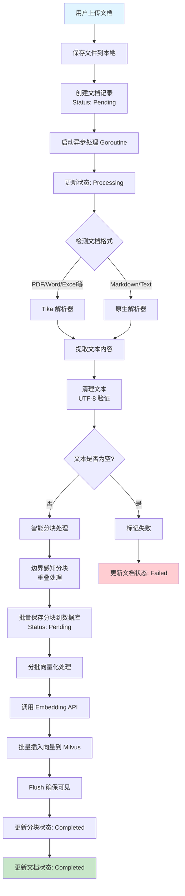
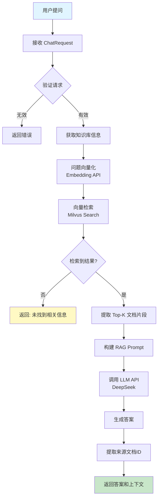
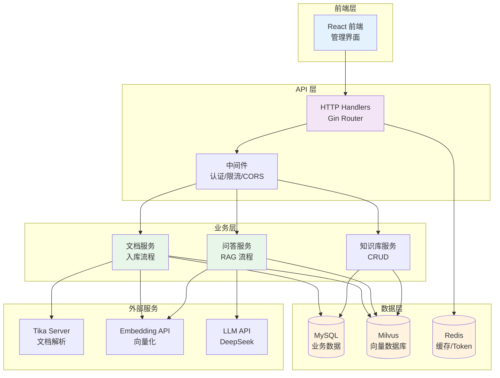
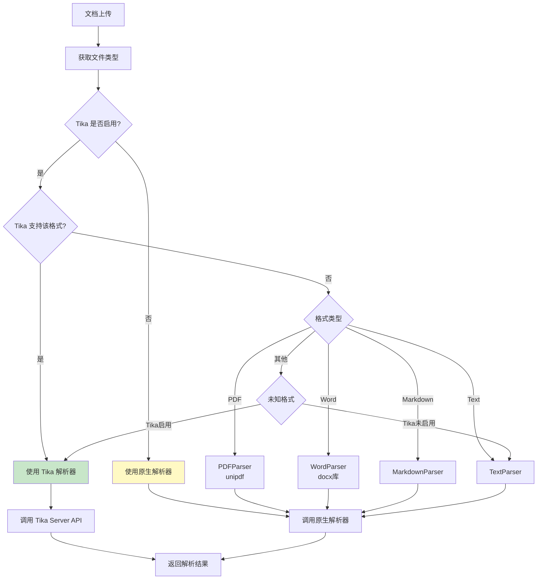

# Ragent 项目概述与技术亮点

## 📋 目录

1. [项目简介](#项目简介)
2. [核心功能](#核心功能)
3. [技术亮点](#技术亮点)
4. [流程图](#流程图)
5. [技术架构](#技术架构)

---

## 🎯 项目简介

**Ragent** 是一个企业级 RAG（检索增强生成）智能体平台，提供从文档入库到智能问答的完整解决方案。

### 核心价值

- ✅ **完整的 RAG 链路**：文档解析 → 分块 → 向量化 → 检索 → 生成
- ✅ **企业级工程实践**：分层架构、设计模式、可扩展性
- ✅ **生产级特性**：限流、熔断、监控、容错
- ✅ **智能化增强**：意图识别、问题重写、会话记忆

---

## 🚀 核心功能

### 1. 文档入库流水线

**功能**：将各种格式的文档转换为可检索的向量

**流程**：
```
文档上传 → 格式检测 → 文档解析 → 文本清理 → 智能分块 → 向量化 → 存储到 Milvus
```

**支持格式**：
- 📄 PDF（支持 Tika 和原生解析器）
- 📝 Word（.docx, .doc）
- 📊 Excel（.xlsx, .xls）- 需 Tika
- 📊 PowerPoint（.pptx, .ppt）- 需 Tika
- 🌐 HTML/XML - 需 Tika
- 📝 Markdown
- 📄 纯文本

**技术特点**：
- 异步处理，不阻塞用户请求
- 批量处理，优化性能
- 进度跟踪，实时反馈
- 错误处理，自动重试

### 2. 知识库管理

**功能**：管理多个知识库，每个知识库对应一个 Milvus Collection

**能力**：
- 创建/删除知识库
- 自动创建 Milvus Collection
- 文档分类管理
- 知识库元数据管理

### 3. RAG 智能问答

**功能**：基于知识库进行智能问答

**流程**：
```
用户问题 → 向量化 → 向量检索 → 上下文组装 → LLM 生成 → 返回答案
```

**特点**：
- 语义检索，理解用户意图
- 多文档片段融合
- 来源追踪，可追溯答案来源
- 上下文优化，提升答案质量

### 4. 用户认证与授权

**功能**：完整的用户管理系统

**能力**：
- JWT Token 认证
- Redis Token 黑名单
- 角色权限管理（管理员/普通用户）
- 可选认证中间件（支持未登录访问）

---

## 💡 技术亮点

### 1. 智能文档解析

**亮点**：双解析器策略

- **Tika Server**：支持 100+ 种格式，企业级稳定
- **原生解析器**：轻量级，性能优秀
- **自动降级**：Tika 不可用时自动使用原生解析器
- **格式检测**：自动识别文档格式

**代码示例**：
```go
// 智能选择解析器
parser := parser.GetParser(fileType)
if tikaEnabled && tikaParser.Support(fileType) {
    // 使用 Tika
} else {
    // 使用原生解析器
}
```

### 2. 优化的文档分块策略

**亮点**：多策略分块算法

- **边界感知分块**：优先在句子/段落边界切分
- **重叠分块**：保持上下文连续性
- **大文件优化**：超大文件使用简单字符分块
- **内存优化**：流式处理，避免 OOM

**技术细节**：
```go
// 智能分块策略
if textSize > 500KB {
    // 超大文件：简单字符分块
    return splitByCharactersSimple(text)
} else {
    // 正常文件：边界感知分块
    return splitWithBoundaries(text)
}
```

### 3. 异步文档处理

**亮点**：非阻塞处理流程

- **Goroutine 异步处理**：不阻塞用户请求
- **超时控制**：30分钟超时保护
- **状态跟踪**：实时更新处理状态
- **错误恢复**：失败自动标记，支持重试

### 4. 向量存储优化

**亮点**：高效的向量管理

- **批量插入**：批量向量化，提升性能
- **自动 Flush**：确保数据立即可见
- **分片存储**：支持大规模数据
- **相似度检索**：高效的向量检索算法

### 5. 字符编码处理

**亮点**：完善的 UTF-8 支持

- **多层字符集配置**：DSN、连接、事务、模型
- **文本清理**：自动清理无效 UTF-8 序列
- **数据库兼容**：确保 MySQL 正确存储中文

### 6. 可扩展的架构设计

**亮点**：清晰的层次结构

```
API Layer (Handler)
    ↓
Service Layer (Business Logic)
    ↓
Repository Layer (Data Access)
    ↓
Model Layer (Data Models)
```

**优势**：
- 职责清晰，易于维护
- 易于测试，Mock 友好
- 易于扩展，新增功能简单

### 7. 配置管理

**亮点**：灵活的配置系统

- **多环境支持**：开发/测试/生产
- **环境变量覆盖**：支持 Docker 部署
- **默认值设置**：开箱即用
- **配置验证**：启动时验证配置

### 8. 完善的错误处理

**亮点**：优雅的错误处理

- **统一错误响应**：标准化的错误格式
- **详细错误日志**：便于排查问题
- **用户友好提示**：清晰的错误信息
- **错误恢复**：自动降级和重试

---

## 📊 流程图

### 1. 文档入库流程图



### 2. RAG 问答流程图



### 3. 系统架构图



### 4. 解析器选择流程图



---

## 🏗️ 技术架构

### 技术栈

| 层面 | 技术选型 | 说明 |
|------|---------|------|
| **后端框架** | Go 1.21+、Gin | 高性能 HTTP 框架 |
| **数据库** | MySQL 8.0 | 业务数据存储 |
| **向量数据库** | Milvus 2.6 | 向量存储和检索 |
| **缓存** | Redis 7 | Token 黑名单、缓存 |
| **文档解析** | Apache Tika + 原生解析器 | 多格式支持 |
| **AI 模型** | DashScope (Embedding)<br/>DeepSeek (LLM) | 向量化和生成 |
| **认证** | JWT + Redis | Token 管理 |
| **API 文档** | Swagger | API 文档生成 |

### 项目结构

```
GoAgent/
├── cmd/server/          # 应用入口
├── internal/
│   ├── api/            # API 层
│   │   ├── handler/    # 请求处理器
│   │   └── middleware/ # 中间件
│   ├── service/        # 业务逻辑层
│   ├── repository/     # 数据访问层
│   ├── model/          # 数据模型
│   ├── config/         # 配置管理
│   └── pkg/           # 内部包
│       ├── ai/        # AI 服务封装
│       ├── milvus/    # Milvus 封装
│       ├── parser/    # 文档解析器
│       └── tika/      # Tika 客户端
├── configs/            # 配置文件
├── scripts/            # SQL 脚本
└── docs/              # 文档
```

### 设计模式应用

| 设计模式 | 应用场景 | 解决的问题 |
|---------|---------|-----------|
| **策略模式** | 解析器选择 | 不同格式使用不同解析策略 |
| **工厂模式** | 解析器工厂 | 统一创建解析器实例 |
| **仓储模式** | Repository 层 | 数据访问抽象 |
| **依赖注入** | Service 层 | 解耦和测试友好 |

---

## 📈 性能优化

### 1. 文档处理优化

- ✅ **异步处理**：不阻塞用户请求
- ✅ **批量操作**：批量保存分块、批量向量化
- ✅ **流式处理**：大文件流式分块，避免 OOM
- ✅ **超时控制**：30分钟超时，防止卡死

### 2. 数据库优化

- ✅ **连接池**：MySQL 连接池管理
- ✅ **批量插入**：分块批量保存
- ✅ **索引优化**：关键字段建立索引
- ✅ **字符集优化**：UTF-8 完整支持

### 3. 向量检索优化

- ✅ **批量检索**：支持批量查询
- ✅ **索引优化**：Milvus HNSW 索引
- ✅ **Flush 机制**：确保数据立即可见
- ✅ **Top-K 限制**：限制返回数量

---

## 🔒 安全特性

1. **JWT 认证**：安全的 Token 机制
2. **Token 黑名单**：支持登出和 Token 撤销
3. **密码加密**：BCrypt 加密存储
4. **CORS 配置**：跨域请求控制
5. **输入验证**：请求参数验证
6. **SQL 注入防护**：GORM 参数化查询

---

## 📝 总结

Ragent 是一个**企业级 RAG 系统**，具有以下特点：

1. **完整性**：覆盖文档入库到智能问答全链路
2. **工程化**：清晰的架构、完善的错误处理
3. **可扩展**：易于添加新功能和新格式
4. **生产级**：异步处理、错误恢复、性能优化
5. **智能化**：智能解析器选择、优化的分块策略

**适用场景**：
- 企业内部知识库问答
- 文档智能检索系统
- RAG 技术学习和实践
- 企业级 AI 应用开发

---

## 🎓 学习价值

1. **RAG 技术**：完整的 RAG 实现流程
2. **Go 语言**：企业级 Go 项目实践
3. **向量数据库**：Milvus 使用和优化
4. **AI 集成**：Embedding 和 LLM 调用
5. **系统设计**：分层架构、设计模式应用
